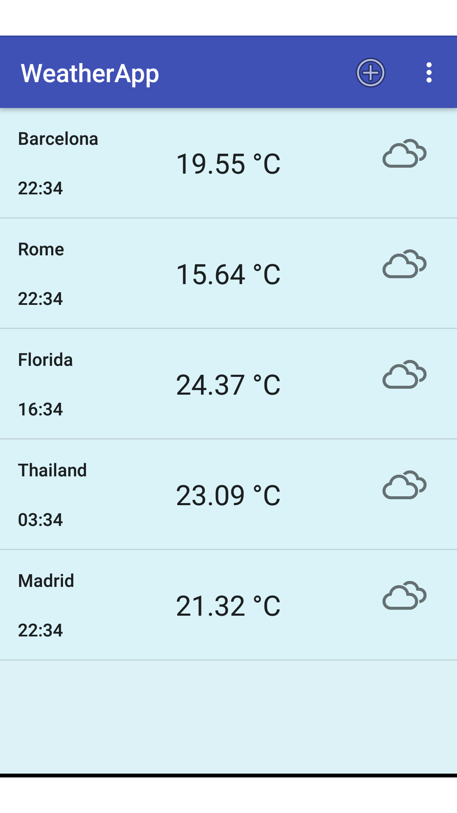
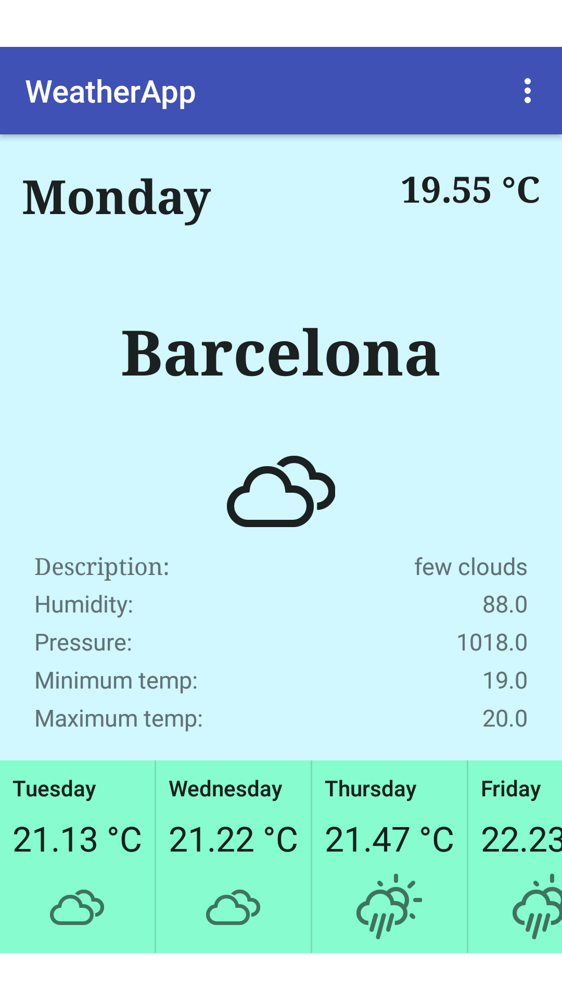
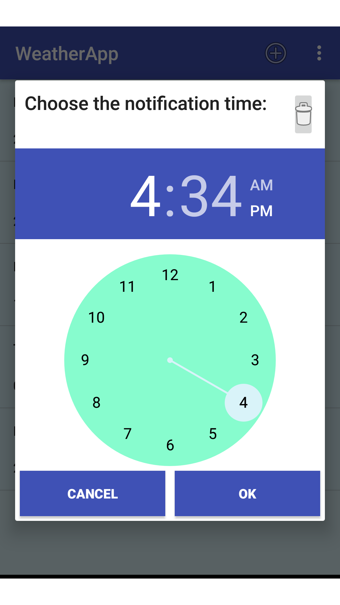
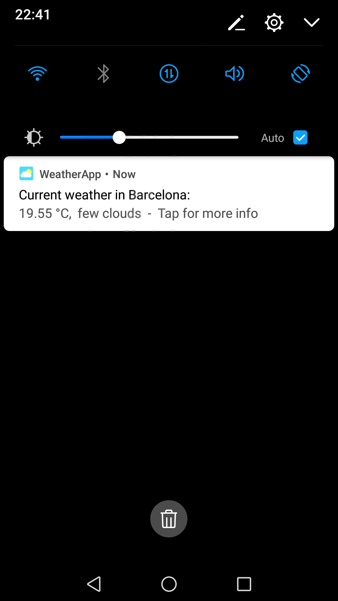

*WEATHERAPP*

I've applied the MVC pattern to develop the application, and there's a list of some frameworks I've used:

-	Retrofit for the API calls
-  Room for the database
-  Butterknife to bind the views
-  Junit to test some things
-  Gson to parse the Json files downloaded from the API calls

(To test the app it is necessary to add a resource file called API_KEYS.xml with the following api keys:

	- OpenWeatherMap API
	- Google Time Zone API
	- Google Places API

	(The names of the resources can be found in the project code.
	 There is also a sample file with the file structure)

Here are some snapshots of the application:

	